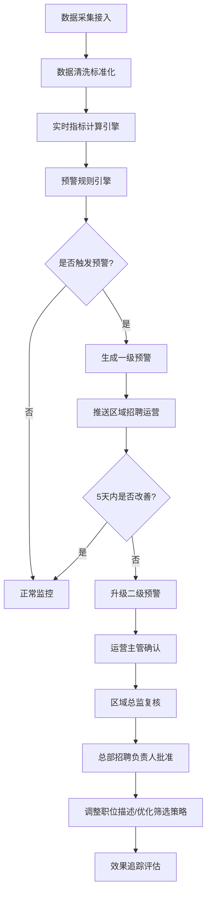

# 全国性在线招聘平台 - 求职与招聘智能分析系统 PRD

## 1. 产品概述

本系统是面向全国性在线招聘平台的智能分析与预警决策系统，服务于总部、区域、企业三级招聘管理人员。通过实时接入职位发布、简历投递、面试邀请、offer发放和入职数据，提供多维度人才供需分析、风险预警和智能决策支持。

- 目标用户：总部招聘负责人、区域招聘总监、企业招聘运营主管
- 核心价值：实现招聘全流程数据可视化、风险预警自动化、人才配置决策智能化

## 2. 核心功能

### 2.1 用户角色

| 角色 | 权限范围 | 核心权限 |
|------|---------|---------|
| 总部招聘负责人 | 全国所有区域、所有企业 | 查看全国数据、审批二级预警、调整全局策略、生成全国报告 |
| 区域招聘总监 | 所辖区域内所有企业 | 查看区域数据、复核二级预警、生成区域报告 |
| 企业招聘运营 | 所辖企业数据 | 查看企业数据、确认预警、调整职位描述、优化筛选策略 |

### 2.2 功能模块

1. **核心看板**：全国投递热力图、职位热度排名、行业/省份切换、城市下钻分析
2. **实时数据计算引擎**：数据清洗、多维度指标实时计算
3. **智能预警系统**：一级预警、二级预警升级、三级审批流程
4. **校招智能规划**：Excel计划上传、人才缺口预测、院校合作路线推荐
5. **权限管理系统**：总部/区域/企业三级数据隔离
6. **周报自动生成**：招聘健康诊断报告、优化建议

### 2.3 页面详情

| 页面名称 | 模块名称 | 功能描述 |
|---------|---------|---------|
| 登录页 | 身份选择 | 支持三级角色登录，权限自动识别 |
| 核心看板 | 全国概览 | KPI指标卡片、实时数据趋势 |
| 核心看板 | 投递热力图 | 按省份展示投递量，支持点击下钻 |
| 核心看板 | 职位热度排名 | TOP10职位/行业热度榜单 |
| 城市详情 | 投递趋势 | 近7天各行业投递趋势曲线 |
| 城市详情 | 人才画像 | 学历分布、经验分布饼图/柱状图 |
| 预警中心 | 预警列表 | 一级/二级预警清单，状态筛选 |
| 预警中心 | 审批流程 | 运营确认→总监复核→总部批准三级审批 |
| 校招规划 | 计划上传 | Excel解析，关键岗位与人数提取 |
| 校招规划 | 缺口预测 | 未来3个月人才缺口预测图表 |
| 校招规划 | 院校推荐 | 最优院校合作路线推荐列表 |
| 报表中心 | 周报查看 | 历史周报列表，支持下载 |
| 权限管理 | 角色分配 | 用户角色、数据范围配置（仅总部） |

## 3. 核心流程

### 3.1 预警处理流程

数据实时采集 → 清洗计算指标 → 触发预警规则（连续3天投递量环比下降>30% 或 面试转化率低于行业均值20%）→ 生成一级预警 → 推送至区域运营 → 5天未改善则升级为二级预警 → 启动三级审批（运营主管确认→区域总监复核→总部招聘负责人批准）→ 调整职位描述或优化筛选策略

### 3.2 核心流程Mermaid图

## 4. 用户界面设计

### 4.1 设计风格

- **主色调**：深海蓝 `#0F3460`（专业、可靠），辅以科技蓝 `#165DFF`
- **强调色**：预警红 `#FF4D4F`、成功绿 `#52C41A`、警告橙 `#FAAD14`
- **中性色**：冷灰系列，数据展示优先保证可读性
- **字体**：展示字体使用 Noto Serif SC（稳重专业），正文字体使用 PingFang SC
- **布局风格**：卡片式模块化布局，顶部全局导航 + 左侧功能菜单 + 主内容区
- **动效**：数据加载骨架屏、卡片悬浮微交互、预警闪烁动画、图表渐进渲染

### 4.2 页面设计概览

| 页面名称 | 模块名称 | UI元素 |
|---------|---------|--------|
| 核心看板 | 顶部指标栏 | 渐变背景KPI卡片，数字滚动动效，趋势箭头指标 |
| 核心看板 | 投递热力图 | 中国地图SVG，省份颜色深浅映射投递量，点击交互下钻 |
| 核心看板 | 热度排名 | 带进度条的排行列表，排名图标徽章 |
| 城市详情 | 趋势曲线 | 多折线叠加图表，支持图例切换，悬浮数据tooltip |
| 预警中心 | 预警列表 | 红黄预警标签，状态徽章，倒计时显示剩余处理时间 |
| 校招规划 | 缺口预测 | 面积图展示预测区间，置信区间带阴影效果 |

### 4.3 响应式

采用桌面端优先设计，最小支持宽度1280px。核心看板支持在1920px以上大屏幕展示更丰富的数据维度。

## 5. 数据指标体系

### 5.1 核心转化率指标

| 指标名称 | 计算公式 |
|---------|---------|
| 投递匹配率 | 符合职位要求的简历数 / 总投递数 × 100% |
| 面试转化率 | 面试邀请数 / 投递匹配数 × 100% |
| Offer接受率 | 接受Offer人数 / Offer发放数 × 100% |
| 入职留存率 | 入职满3个月人数 / 实际入职人数 × 100% |

### 5.2 维度

行业、职位类别、省份/城市、学历、工作经验、时间（日/周/月）
