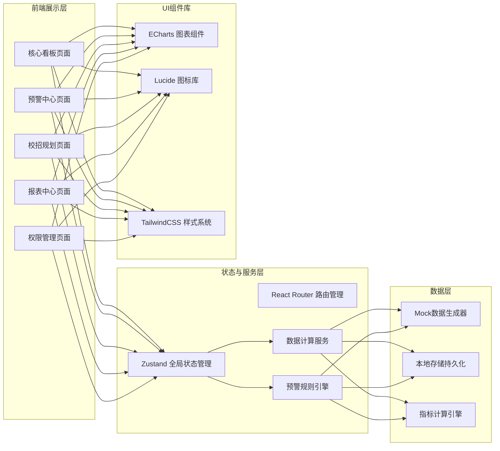
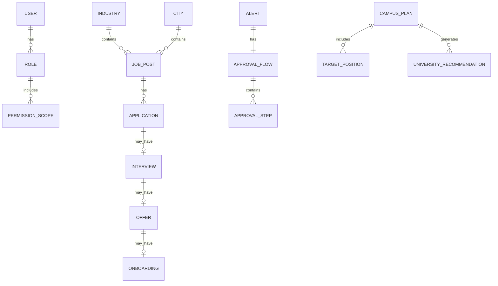

# 全国性在线招聘平台 - 求职与招聘智能分析系统 技术架构

## 1. 架构设计



## 2. 技术描述

- **前端框架**：React@18 + TypeScript@5
- **构建工具**：Vite@5
- **样式方案**：TailwindCSS@3
- **状态管理**：Zustand@4
- **路由管理**：React Router DOM@6
- **图表库**：ECharts@5（中国地图热力图、折线图、柱状图、饼图、面积图）
- **UI图标**：Lucide React@0.400
- **Excel解析**：SheetJS (xlsx)
- **后端**：无后端，全部采用前端Mock数据模拟
- **数据持久化**：LocalStorage

## 3. 路由定义

| 路由路径 | 页面名称 | 权限要求 | 用途 |
|---------|---------|---------|-----|
| /login | 登录页 | 公开 | 用户身份认证与角色选择 |
| /dashboard | 核心看板 | 全部角色 | 全国概览、热力图、热度排名 |
| /dashboard/city/:cityId | 城市详情 | 全部角色 | 城市投递趋势、人才画像分析 |
| /alerts | 预警中心 | 全部角色 | 预警列表、审批流程 |
| /campus | 校招规划 | 总部/区域 | Excel上传、缺口预测、院校推荐 |
| /reports | 报表中心 | 全部角色 | 周报查看与下载 |
| /permissions | 权限管理 | 仅总部 | 用户角色与数据范围配置 |

## 4. 数据模型

### 4.1 数据模型ER图



### 4.2 核心类型定义

```typescript
// 用户与权限
interface User {
  id: string;
  name: string;
  email: string;
  role: 'hq' | 'region' | 'enterprise';
  scope: {
    regions?: string[];
    enterprises?: string[];
  };
}

// 招聘数据
interface JobPost {
  id: string;
  title: string;
  industry: string;
  city: string;
  province: string;
  education: string;
  experience: string;
  publishedAt: Date;
}

interface Application {
  id: string;
  jobId: string;
  isMatched: boolean;
  appliedAt: Date;
}

interface Interview {
  id: string;
  applicationId: string;
  invitedAt: Date;
}

interface Offer {
  id: string;
  interviewId: string;
  sentAt: Date;
  accepted: boolean;
}

interface Onboarding {
  id: string;
  offerId: string;
  onboardedAt: Date;
  retained3Months: boolean;
}

// 预警系统
interface Alert {
  id: string;
  type: 'delivery_drop' | 'conversion_low';
  level: 1 | 2;
  industry: string;
  region: string;
  triggeredAt: Date;
  status: 'pending' | 'processing' | 'approved' | 'resolved';
  approvalFlow: ApprovalFlow;
}

interface ApprovalFlow {
  id: string;
  steps: ApprovalStep[];
  currentStepIndex: number;
}

interface ApprovalStep {
  role: 'operation' | 'director' | 'head';
  approved: boolean;
  approverId?: string;
  approvedAt?: Date;
  comment?: string;
}

// 校招规划
interface CampusPlan {
  id: string;
  enterpriseId: string;
  year: number;
  positions: TargetPosition[];
  forecasts: GapForecast[];
  recommendations: UniversityRecommendation[];
}

interface TargetPosition {
  name: string;
  headcount: number;
  city: string;
  major: string;
}
```

## 5. 项目目录结构

```
/
├── src/
│   ├── components/          # 可复用UI组件
│   │   ├── charts/          # ECharts图表组件
│   │   │   ├── HeatMap.tsx
│   │   │   ├── TrendLine.tsx
│   │   │   ├── PieDistribution.tsx
│   │   │   ├── BarRanking.tsx
│   │   │   └── ForecastArea.tsx
│   │   ├── layout/          # 布局组件
│   │   │   ├── AppLayout.tsx
│   │   │   ├── Sidebar.tsx
│   │   │   └── Header.tsx
│   │   ├── cards/           # 卡片组件
│   │   │   ├── KpiCard.tsx
│   │   │   └── AlertCard.tsx
│   │   └── common/          # 通用组件
│   ├── pages/               # 页面组件
│   │   ├── Login.tsx
│   │   ├── Dashboard.tsx
│   │   ├── CityDetail.tsx
│   │   ├── Alerts.tsx
│   │   ├── CampusPlanning.tsx
│   │   ├── Reports.tsx
│   │   └── Permissions.tsx
│   ├── store/               # Zustand状态管理
│   │   ├── useAuthStore.ts
│   │   ├── useDataStore.ts
│   │   └── useAlertStore.ts
│   ├── data/                # Mock数据与常量
│   │   ├── mockData.ts
│   │   ├── chinaMapData.ts
│   │   ├── industries.ts
│   │   └── universities.ts
│   ├── utils/               # 工具函数
│   │   ├── calculators.ts   # 指标计算引擎
│   │   ├── alertEngine.ts   # 预警规则引擎
│   │   ├── excelParser.ts   # Excel解析
│   │   ├── forecast.ts      # 缺口预测
│   │   └── permissions.ts   # 权限校验
│   ├── types/               # TypeScript类型定义
│   ├── hooks/               # 自定义Hooks
│   ├── App.tsx
│   ├── main.tsx
│   └── index.css
├── .trae/documents/         # PRD与架构文档
├── package.json
├── vite.config.ts
├── tailwind.config.js
└── tsconfig.json
```
